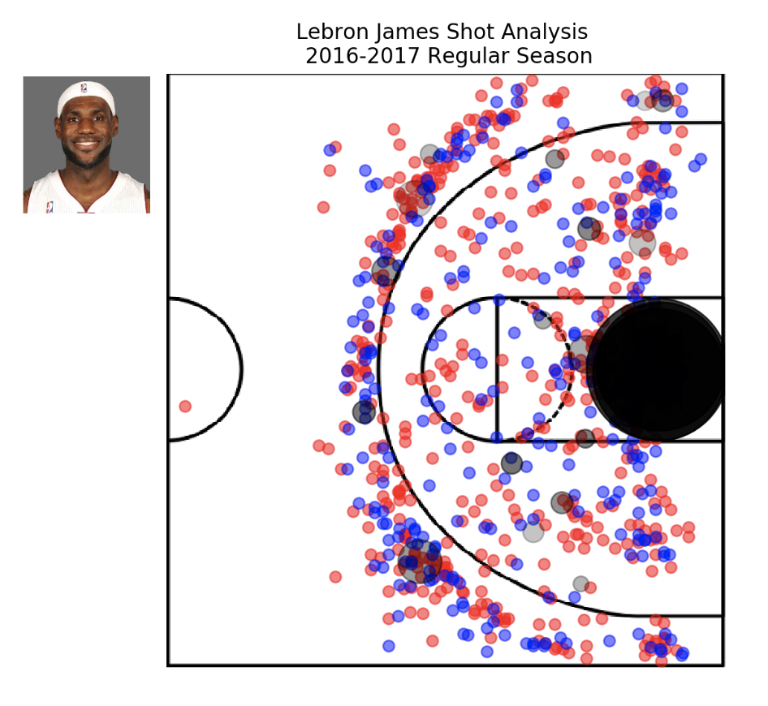
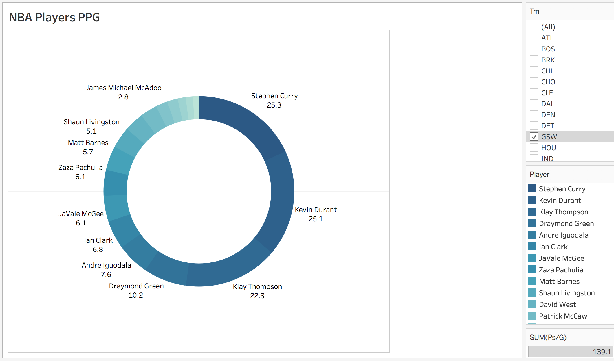
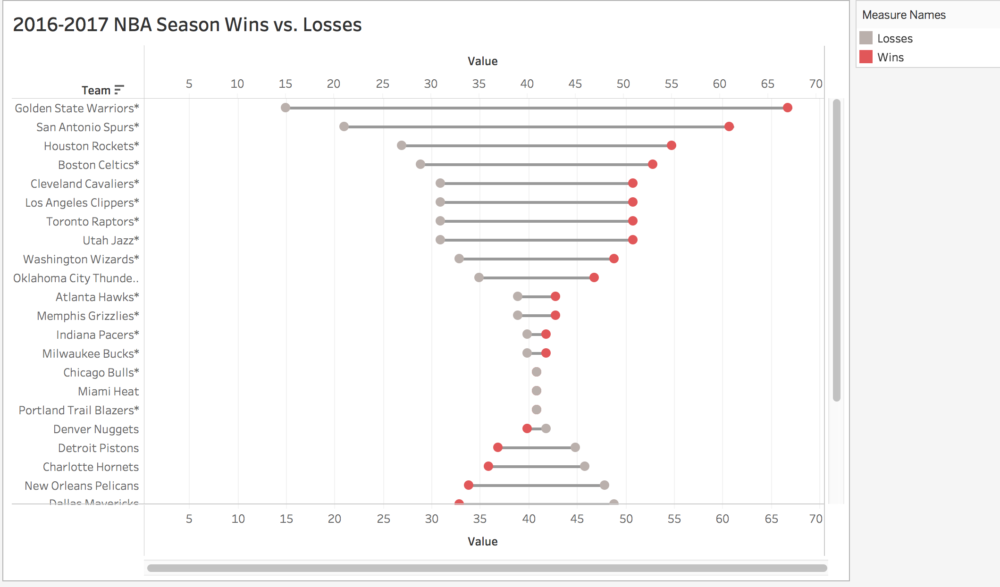

# NBA Players' Shot Analytics

## Motivation
- Sports, Sporting Events, and Athletes are a connecting point for individuals from anywhere and from any background. It gives us a common ground and an excitement to contemplate and debate, and gives us a chance to compete and be a fan.

- This NBA project was a motivating factor to show each other the intricacies of sports and how each team, each player, and each shot can impact a team and a players profile. It gave us both a better understanding of the game of Basketball on a fundamental basis.

##Questions Asked
A few questions we asked ourselves before starting the project:
- Can we visualize a players statistics (Points, Rebounds, Assists) over an entire season?
- What can this visualization show us about the player? (3-point scorer, mid-range shooter, etc.)
- Can we use the data visualizations to better understand where a player fits on a team and there value to the team?
- Can the data visualizations be used to help players improve their game as well as coaches to improve defensive schemes? 

## Tools used
- Pandas
- Python
- Matplotlib

## Data Source
- Kaggle
(https://www.kaggle.com/wh0801/NBA-16-17-regular-season-shot-log)
 All shot logs of all players who played in the 2016-2017 regular season

- Basketball Reference
(https://www.basketball-reference.com/leagues/NBA_2017.html)
 Extensive stats for all the games/players.

## Shooting Analysis

This plot analyses the shooting style of LeBron James. The blue dots represent all the shots made by LeBron in the 2016-2017 regular season. The red ones indicate the shots missed. The black dots indicate the spots LeBron is most likely to shoot from.

The black dots represent top 25 spots that LeBron is most likely to shoot from. The size of the dots represent the relative probability of LeBron shooting from that position and the darkness of the dot illustrates his shot accuracy from that spot (with darker shades representing a higher accuracy).

## Tableau Visualization 

We also visualized some stats for the teams that played in the 2016-2017 regular season. (https://public.tableau.com/profile/garima.sharma1268#!/)

The donut chart represents points per game by every player in the NBA season. It can be filtered down further by teams to represent stats of individual teams.

The barbell chart depicts the number of wins and losses of every team. The teams with * qualified to the

